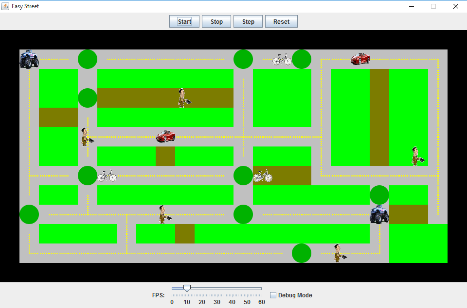

# Easy Street
### TCSS 305 Programming Prcticum

The program is a simulator of a city and its streets, along with vehicles and obstacles on them.  
[Full assignment description.](https://www.dropbox.com/s/fuihupfypxls6vs/hw3-easystreet.pdf?dl=0)

### Objectives
* Write classes to model the various vehicles in the city.
* Use inheritance to design the classes effectively.
* Create four specified vehicle classes (and a common parent class).
* Implement a debug option for easy testing.

### Example

